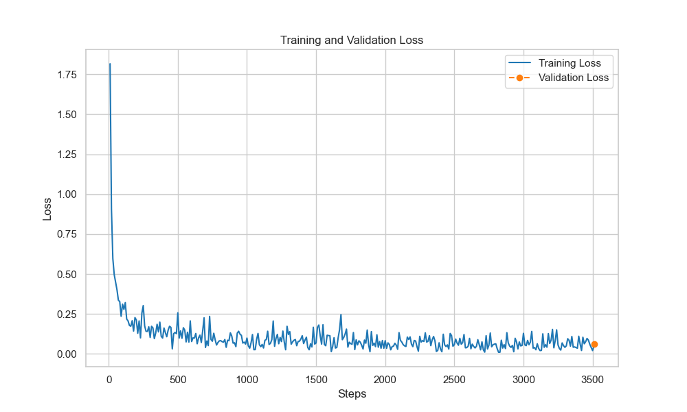
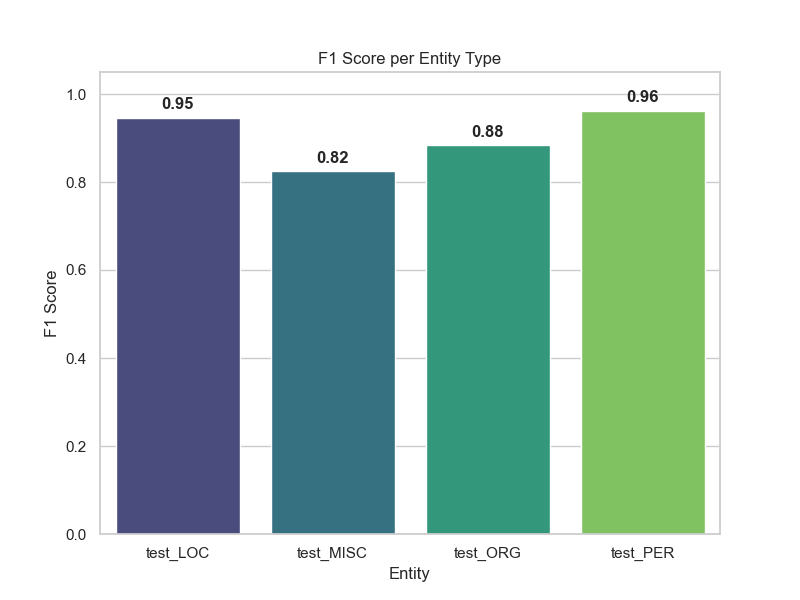
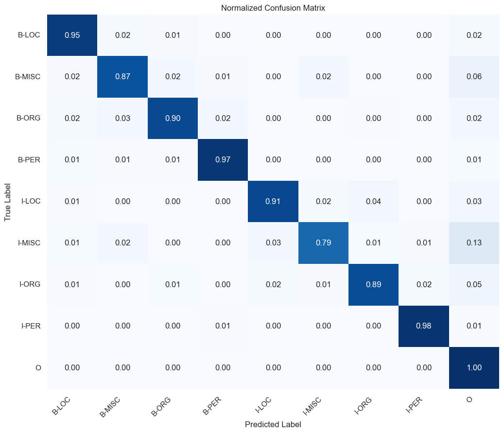

# NER Model Evaluation Report

## 1. Executive Summary
The objective of this project was to develop a Named Entity Recognition (NER) model using Token Classification. The selected **DistilBERT-base-cased** architecture achieved an **F1-score of 0.9191** after 1 epoch of training. This performance demonstrates the model's reliability in identifying core entities, including Persons, Locations, and Organizations. [cite: 2026-01-21]

## 2. Quantitative Results (Validation Metrics)
The following data was calculated based on the validation set (eng.testa):

| Entity Type | Precision | Recall | F1-Score | Sample Count |
| :--- | :--- | :--- | :--- | :--- |
| **LOC** (Location) | 94.84% | 93.96% | **94.39%** | 1837 |
| **PER** (Person) | 96.00% | 96.53% | **96.26%** | 1842 |
| **ORG** (Organization) | 89.44% | 88.44% | **88.94%** | 1341 |
| **MISC** (Miscellaneous) | 81.67% | 83.62% | **82.64%** | 922 |
| **Overall** | **91.91%** | **91.91%** | **91.91%** | **5942** |

## 3. Visual Analysis

### Learning Curve

*During the training process, Loss values decreased steadily. The validation point (0.0614) closely follows the training trend, indicating that the model does not suffer from overfitting.*

### Entity Performance

*The chart illustrates that the model delivers its most stable performance in the PER and LOC categories, both exceeding a 94% F1-score.*

### Confusion Matrix

*The matrix confirms sharp classification boundaries between categories. The most frequent error is the classification of MISC entities as "O" (Outside) tags.*

## 4. Qualitative Testing (Inference)
Results from testing the trained model on real-world sample sentences:

* **Successful Identifications:**
    * **"Apple"** -> ORG (Confidence: 98.98%)
    * **"Steve Jobs"** -> PER (Confidence: 99.37%)
    * **"Budapest"** -> LOC (Confidence: 99.94%)
* **Observations:**
    * **"Elon Musk"** was classified as an ORG in this specific test. This is likely due to the linguistic context ("Elon Musk bought Twitter"), where the model tends to associate the subject of the verb "bought" with organizational entities based on its training distribution.

